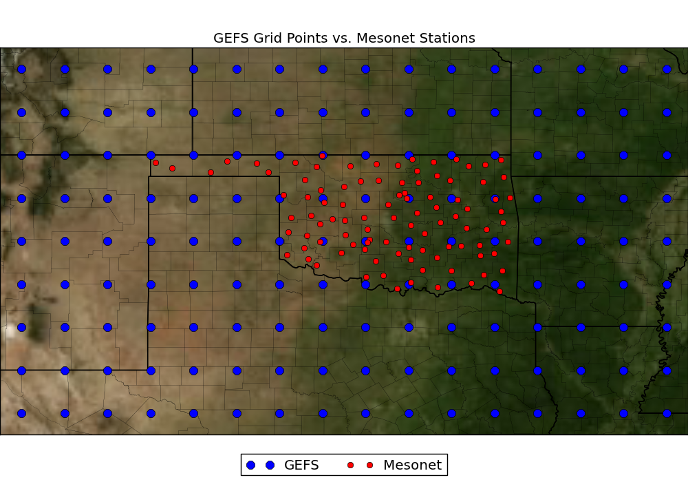

```{r setup, include=FALSE}
knitr::opts_chunk$set(echo = TRUE)
```

```{r funciones_auxiliares, include=FALSE}
namedSeq <- function(name, stop, steps=1, start=1) {
  return(paste(name, seq(from=start, to=stop, by=steps), sep=""))
}

nameCols <- function(data) {
  dimnames(data)[[5]] <- namedSeq("time_", 5113)
  ## Latitud
  dimnames(data)[[2]] <- namedSeq("", 39, start=31)
  ## Longitud
  dimnames(data)[[1]] <- namedSeq("", 269-360, start=254-360)
  dimnames(data)[[4]] <- namedSeq("ens_", 11)
  dimnames(data)[[3]] <- namedSeq("fhour_", 24, steps=3, start=12)
  
  return (data)
}
```


# Preparación

## Librerías
```{r librerias}
library(ncdf4)
```

## Cargar datos

### Predictores
```{r cargar_predictores}
## Flujo de radiación, onda larga
dlwrf <- nc_open("../../data/train/dlwrf_sfc_latlon_subset_19940101_20071231.nc")
## Flujo de radiación, onda corta
dswrf <- nc_open("../../data/train/dswrf_sfc_latlon_subset_19940101_20071231.nc") 
```

### Datos de las estaciones
```{r estaciones}
stations <- read.csv("../../data/station_info.csv")
```

### Resultados de entrenamiento
```{r energy_train}
energy_train <- read.csv("../../data/train.csv")
```
# Exploración de los datos

Todos los predictores tienen el mismo formato:

**3 variables:**

* intTime
* intValidTime
* *\<Variable de interés\>*

**Cada variable tiene 5 dimensiones:**

* time
* lat
* lon
* ens
* fhour
  
```{r exploracion_general}
print(attributes(dlwrf$var))
print(attributes(dswrf$var))

# Ver el formato
print(dlwrf)
```
## Datos de interés
Cada variable tiene exactamente las mismas cinco dimensiones. 
Del resumen impreso arriba podemos rescatar los siguientes valores importantes:

Dimensión     | Tamaño      | Valor Mínimo    | Valor Máximo    |
------------- | ------------|-----------------|-----------------|
Latitud       | 9           | 31              | 39             |
Longitud       | 16           | 254              | 269             |
Ensemble       | 11           | 1              | 11             |
fHour       | 5           | 12              | 24             |
Tiempo       | 5113           |  1700586             | 1823256    |

### Latitud y Longitud

Representan valores en la zona geográfica de interés.

En esta área, solo toman los siguientes valores:

* Latitud: [31° - 39°]
* Longitud: [254° - 269°]



En estos datos, la longitud está en **grados positivos desde el meridiano cero**,
llegando hasta 360°.
Por otro lado, las coordenadas de las estaciones meteorológicas tienen este dato
en valores que van de 0° a 180°, ya sea al Este u Oeste.

```{r longitud_estaciones}
head(stations)
```

Esto será tomado en cuenta al etiquetar la longitud en los datos de entrenamiento.

```{r ncvar_get_vars}
# Primero obtener las variables de interés
dlwrf.data <- ncvar_get(dlwrf, "Downward_Long-Wave_Rad_Flux")
dswrf.data <- ncvar_get(dswrf, "Downward_Short-Wave_Rad_Flux")
```

```{r etiquetar_lon_lat}
# Etiquetar las dimensiones Latitud y Longitud
# Latitud: 9 [Índice 2]
# Longitud: 16 [Índice 1]
dim(dlwrf.data)

# Valores obtenidos del resumen
lat.inicial = 31
lat.final = 39
# Se resta 360 para convertir de grados positivos a la representación que tienen
# las coordenadas de las estaciones.
lon.inicial = 254 - 360
lon.final = 269 - 360

dimnames(dlwrf.data)[[2]] <- seq(from=lat.inicial, to=lat.final)
dimnames(dlwrf.data)[[1]] <- seq(from=lon.inicial, to=lon.final)

dimnames(dswrf.data)[[2]] <- seq(from=lat.inicial, to=lat.final)
dimnames(dswrf.data)[[1]] <- seq(from=lon.inicial, to=lon.final)

# Muestra de como queda etiquetado
print(dlwrf.data[,,1,1,1])
```
### Ensemble
De acuerdo con el [glosario](https://forecast.weather.gov/glossary.php?word=ENSEMBLE)
de la agencia que provee el conjunto de datos, un *ensemble* se define como:

> Colección de modelos numéricos que muestran resultados ligeramente diferentes.

```{r comparacion_ensembles}
e1 <- dlwrf.data[,,,1,]
e2 <- dlwrf.data[,,,2,]
e3 <- dlwrf.data[,,,3,]
e4 <- dlwrf.data[,,,4,]
e5 <- dlwrf.data[,,,5,]

comparativo <- c(e1[1,1,1,1], e2[1,1,1,1], e3[1,1,1,1], e4[1,1,1,1], e5[1,1,1,1])
print(comparativo)
```
El primer *ensemble* es el de control, y es el que será utilizado para este modelo.

```{r extraer_ensemble}
dlwrf.data.e1 <- dlwrf.data[,,,1,]
dswrf.data.e1 <- dswrf.data[,,,1,]

dim(dlwrf.data.e1)
```
### Forecast Hour
Es la hora a la cual la estación meteorológica hace su pronóstico sobre la 
variable de interés. Esto sucede cinco veces en el día: Empieza a las 12,
y se repite en intervalos de 3 horas, terminando a las 24.

```{r etiquetar_fhour}
dimnames(dlwrf.data.e1)[[3]] <- namedSeq("fhour_", 24, steps=3, start=12)
dimnames(dswrf.data.e1)[[3]] <- namedSeq("fhour_", 24, steps=3, start=12)

print(dlwrf.data.e1[1,1,,1])
```
### Tiempo
Es la fecha en la que se tomó la medición de la variable. Esta columna corresponde
directamente con una de las respuestas en los datos de entrenamiento.

Sus valores son obtenidos de la variable `time` contenida en el conjunto de datos.

```{r extraer_tiempo}
# Todas las variables manejan el mismo tiempo
time <- ncvar_get(dlwrf, "time")

# Diferente formato
head(time)
head(energy_train$Date)
```
Comparando la variable `time` con las fechas de los datos de entrenamiento, se 
observa que su formato no coincide. Cada una está representando su tiempo de 
forma distinta:

| Variable | Formato |
|----------|---------|
| `time` | Horas desde 1800-01-01 00:00:00 |
| `energy_train$Date` | Fecha formato YYYYMMDD |

Por lo tanto es necesario convertir nuestro tiempo en horas, a fecha.

```{r hora->fecha}
dates <- as.Date(as.POSIXct(time*3600, origin='1800-01-01 00:00:00', 'UTC'))
dates <- gsub('-', '', dates)
# Además, energy_train$Date tiene sus fechas como ints
dates <- strtoi(dates)

head(dates)
head(energy_train$Date)
```
Con estos valores, se pueden etiquetar nuestros predictores:

```{r etiquetar_hora}
dimnames(dlwrf.data.e1)[[4]] <- dates
dimnames(dswrf.data.e1)[[4]] <- dates

head(dlwrf.data.e1[1,1,1,])
```

# Preparar los subconjuntos de entrenamiento

## Predictores
En este primer experimento se hará un modelo solo para el sitio de generación 
**ACME**.

Para identificar los datos que son útiles para este sitio particular se utilizan
las coordenadas:

```{r coordenadas_acme}
print(names(stations))
acme <- stations[stations["stid"] == "ACME"]
print(acme)

# Se redondea porque los archivos de los predictores tienen coordenadas enteras.
# Se tomará la medición más cercana.
acme.lat <- as.character(round(as.numeric(acme[2])))
acme.lon <- as.character(round(as.numeric(acme[3])))
print(c(acme.lat, acme.lon))
```
Se determinó que las coordenadas más cercanas a ACME son: (35, -98).

Con estos datos extraemos las mediciones correspondientes.

```{r mediciones_acme}
acme.dlwrf <- dlwrf.data.e1[acme.lon, acme.lat,,]
acme.dswrf <- dswrf.data.e1[acme.lon, acme.lat,,]

# Para simplificar este primer experimento, se decidió promediar las predicciones
# a lo largo del día
acme.dlwrf.means <- colMeans(acme.dlwrf)
acme.dswrf.means <- colMeans(acme.dswrf)
acme.final <- data.frame(
  Date = names(acme.dlwrf.means),
  dlwrf = acme.dlwrf.means,
  dswrf = acme.dswrf.means)
print(acme.final)
```

## Respuesta esperada
Ya que se tienen los predictores, solo hace falta conocer cuánta energía se 
generó en ACME con esos valores de `dlwrf` y `dswrf`.

```{r energia_acme}
energy.acme <- energy[c("Date", "ACME")]
colnames(energy.acme) <- c("Date", "ACME")

# Hay que tener el mismo formato para combinarlo con nuestros predictores
energy.acme <- transform(energy.acme, Date=as.character(Date))
print(energy.acme)
```

Y se combina con los predictores en un solo Dataframe para poder crear modelos.
```{r crear_datos_entrenamiento_final}
energy.acme <- merge(energy.acme, acme.final, by="Date")
print(energy.acme)
```

# Creación de modelos

## Regresión lineal simple

Usando un solo predictor: dlwrf

Observaciones:

* Se detecta un patrón no-lineal en la gráfica de *Residuals vs Fitted*
* La gráfica *Q-Q* indica que los residuales no están distribuidos de forma normal
* No se identifican puntos de apalancamiento
* La efectividad del modelo es pésima, lo que era de esperarse
* El predictor dlwrf parece ser significativo

```{r rls}
lm.fit <- lm(ACME ~ dlwrf, data=energy.acme)
plot(lm.fit)
summary(lm.fit)
```
**Observaciones**

* Casi se elimina el patrón no-lineal en la gráfica **Residuals vs Fitted**
* La efectividad del modelo mejora marginalmente
```{r rls_sqrd}
lm.fit2 <- lm(ACME ~ dlwrf + I(dlwrf^2), data=energy.acme)
plot(lm.fit2)
summary(lm.fit2)
```

## Regresión lineal múltiple

Verificamos que no haya correlación entre los datos
```{r correlacion}
plot(energy.acme$dlwrf, energy.acme$dswrf)
```
```{r rlm}
lmm.fit <- lm(ACME ~ dlwrf + dswrf, data=energy.acme)

plot(lmm.fit)
summary(lmm.fit)
```

```{r rlm2}
lmm.fit2 <- lm(ACME ~ poly(dlwrf, 2) + poly(dswrf, 2), data=energy.acme)

plot(lmm.fit2)
summary(lmm.fit2)
```

